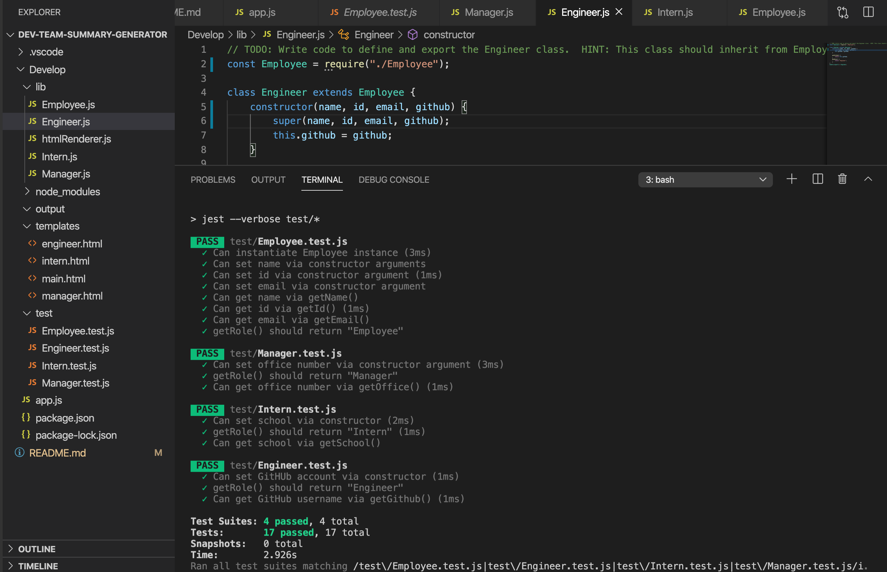

TITLE:
Dev-Team-Summary-Generator

DESCRIPTION:
This command line application is designed to automatically generate a summary for each member of the Development Team which includes their contact information and role-specific property. This generator is primarily used to add/remove members of the team on projects as they evolve, be a central point to contact the team, and see what projects they are working on so that you, as the Manager, can add on or reassign members to other projects if necessary.

USER STORY:
As a manager
I want to generate a webpage that displays my team's basic info
so that I have quick access to emails and GitHub profiles

TESTS

